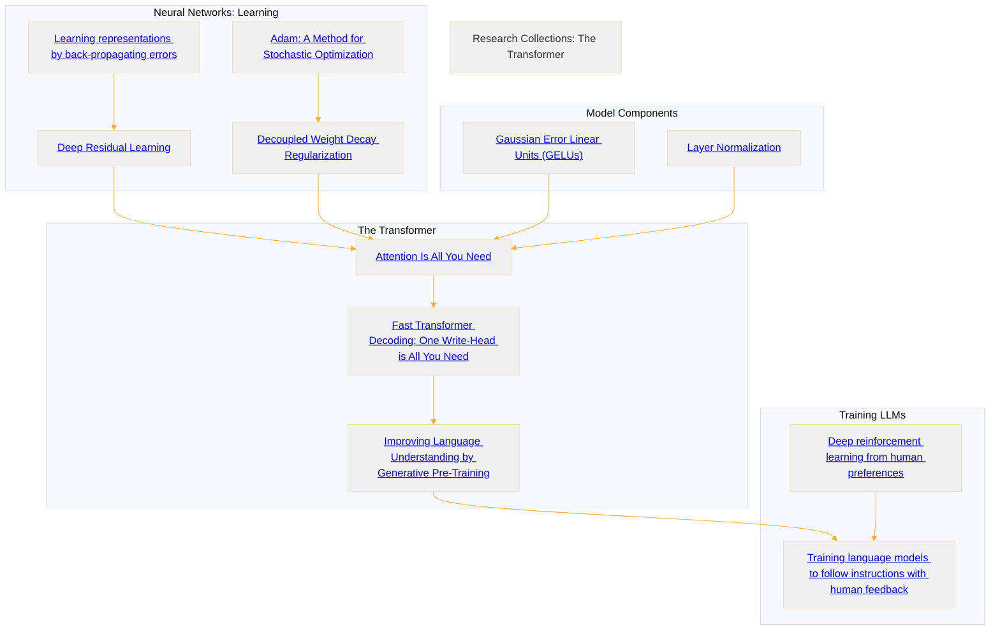

# The Transformer
<aside>
📢 TLDR: Links and notes to transformer related research papers.

</aside>

Below is a list of all the important research papers to fully understand the transformer architecture as introduced in the “Attention is all you need” paper by Google in 2017. 

This page has a collection of research papers + notes in a directed graph to indicate dependencies between the papers and is to be used as a reference page. Obviously there’s still more to add (RNNs, LSTMs, etc), and they are on my reading list and will be added in time.

### Neural Networks

Neural networks have been around for a while and these are core components of what allows neural networks and transformers to be effective at what they do.

- [**Learning representations by back-propagating errors](https://www.cs.utoronto.ca/~hinton/absps/naturebp.pdf) -** Back-propagation was introduced here, couldn’t find the original paper. This was done by Hinton and co and was what lead to the AI era of the 80s. Before this paper Multi-layer-perceptrons (MLPs) weren’t very common because they were very, very difficult to train.

- [**Deep Residual Learning for Image Recognition](https://arxiv.org/abs/1512.03385)** - The introduction of residuals (also known as skip connections) allowed for deeper networks. Before this paper the depth of a neural network was limited because it would diverge enough and back propagation was really, really difficult to do because of vanishing gradients. Residuals essentially have a “short circuit” past a block which allows for gradients to flow backwards through back propagation to earlier components without needing to go through intermediate layers. This greatly speeds up convergence.

- [**Layer Normalization](https://arxiv.org/abs/1607.06450) -** Layernorm happens in each layer to make sure that the values don’t explode and is applied at each layers output activations. It makes the surface more regular so that it’s more symmetrical and easier to optimize over. This means that weight updates can take the same increment step in all directions and not need to worry about overstepping in one dimension but under-stepping in another, and the outputs of the activations will be more regular so that the inputs to the activation functions are all within the same order of magnitude - for example one input to a neuron being 0.00001 and another one being 1,000,000 would cause a lot of problems for floating point rounding and quantization, for example.

- [**Gaussian Error Linear Units (GELUs)](https://arxiv.org/abs/1606.08415v5) -** Activation function ****that leaves positive values unchanged but maps negative numbers to near zero. Implemented here in [llm.go](https://github.com/joshcarp/llm.go/blob/56de2430b95ff3f89657637a4c97794653a994ec/math.go#L414). Other architectures use different activation functions. For example, OpenElm uses SwiGLU FFN which I don’t exactly understand. Should probably add that to the reading list.

### Optimizers

Optimizers are the functions that control how the weights get changed during training.

- [**Adam: A Method for Stochastic Optimization](https://arxiv.org/abs/1412.6980) -** Introduced the Adam optimiser. Weight updates are important because it causes the training to converge more quickly. Adam has two parameters for each model parameter.
- [**Decoupled Weight Decay Regularization](https://arxiv.org/abs/1711.05101) -** Introduces AdamW optimiser used in the first transformer. Adam with weight where weight increases as time goes on.

### The Transformer

- [**Attention Is All You Need](https://arxiv.org/abs/1706.03762v7) -** The OG introduced the idea of self-attention and the encoder/decoder architecture for language translation tasks (the encoder later got dropped because it was only used for translation). Another breakthrough from this paper was the training; “The Transformer allows for significantly more parallelisation and can reach a new state of the art in translation quality after being trained for as little as twelve hours on eight P100 GPUs.” - This fact here was what let it: overtake RNNs (which weren’t parallelisable), and lead NVIDIA to be worth more than 2.7 Trillion token credits.

- [**Improving Language Understanding by Generative Pre-Training](https://cdn.openai.com/research-covers/language-unsupervised/language_understanding_paper.pdf) -** This paper introduced the “GPT” which was a breakthrough at the time. It introduced the idea of using next token prediction as a way to do self-supervised learning, which meant that we can put all of the internet into it and with a simple loss function over the vocabulary adjust the weights via back propagation.

- [**Fast Transformer Decoding: One Write-Head is All
You Need](https://arxiv.org/pdf/1911.02150) -** People always point to the original Attention is all you need paper or the GPT paper that introduced the *decoder only* model~~, but this one was the first one that actually used it in practice. It also has very nice implementations of a transformer in python.~~  This previous explanation was incorrect as the GPT paper was released in 2018, a full year before this paper was released. The GPT paper introduced the concept of a decoder only model, but this paper coined the term “decoder only” model (I think)

### Training

These papers introduced methods to align LLMs to human preferences, and therefore allow them to be useful as chatbots/instruct models, etc.

- [**Deep Reinforcement Learning from Human Preferences](https://arxiv.org/abs/1706.03741) -** Reward modelling is introduced in this paper and allows for a small amount of human time to train a model that sits in as a “human proxy”. This allows for the model to train multiple orders of magnitude more human-time efficient than having a human sit there for 1,000 years judging if a simulation looks like it’s walking correctly.

- [**Training language models to follow instructions with human feedback](https://arxiv.org/pdf/2203.02155) -** Reinforcement learning used on language models for the first time. This is what allowed for “Pre-Trained” (the P in GPT), to be useful for downstream tasks like being a chat-bot and other things.